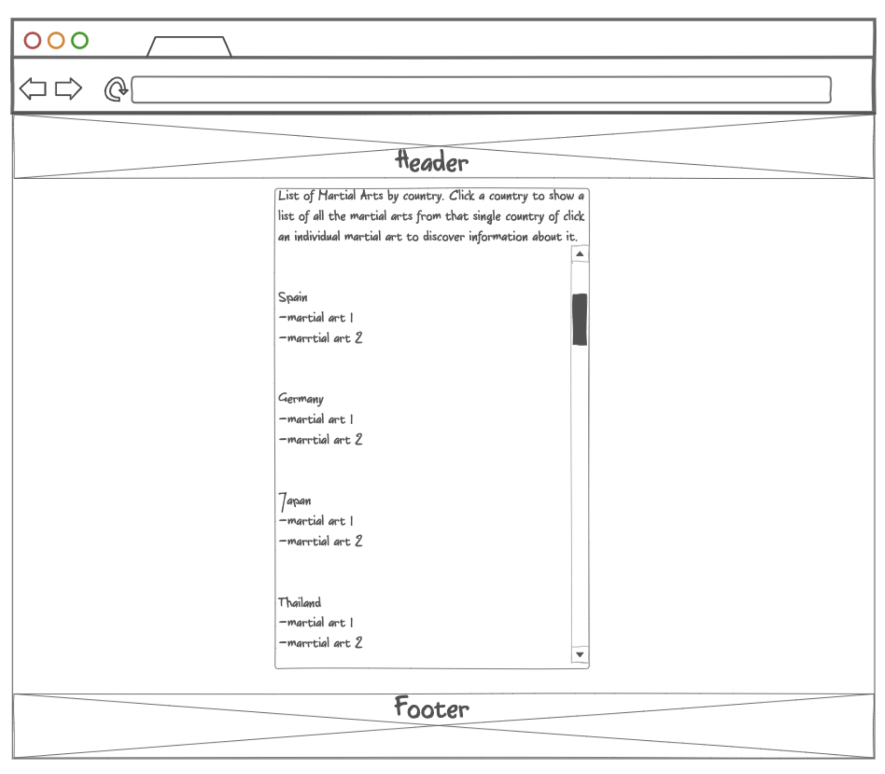
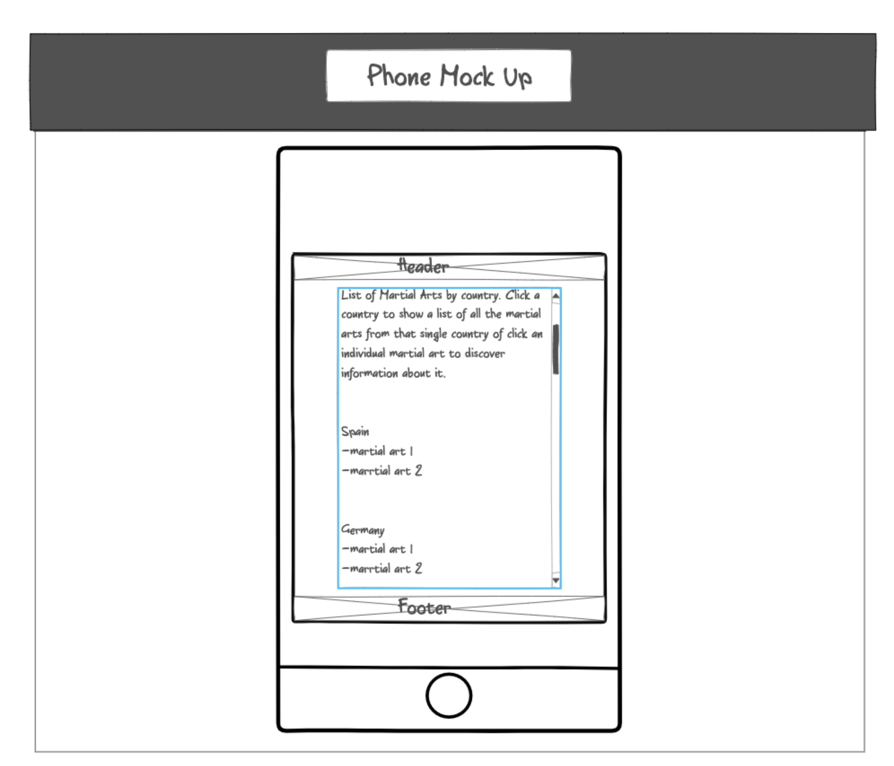
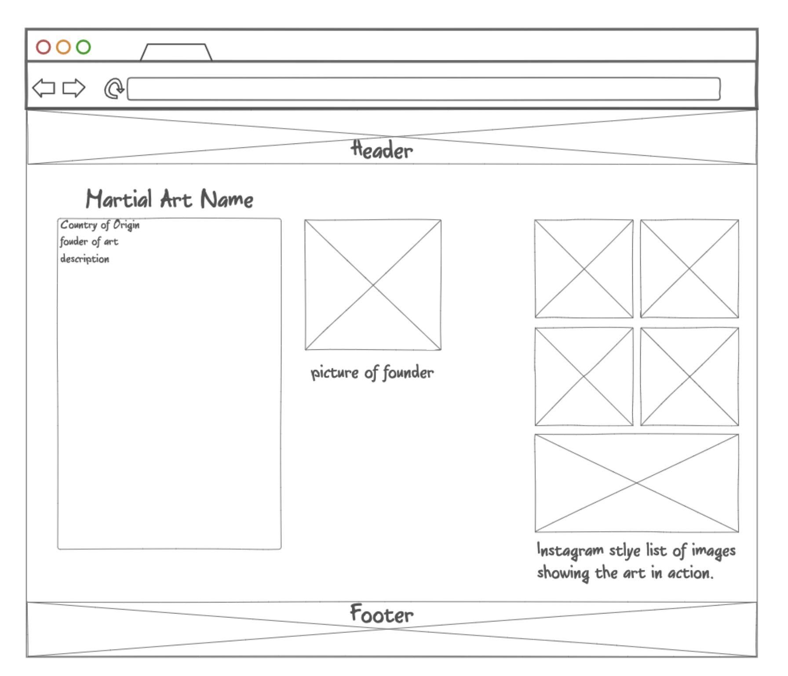
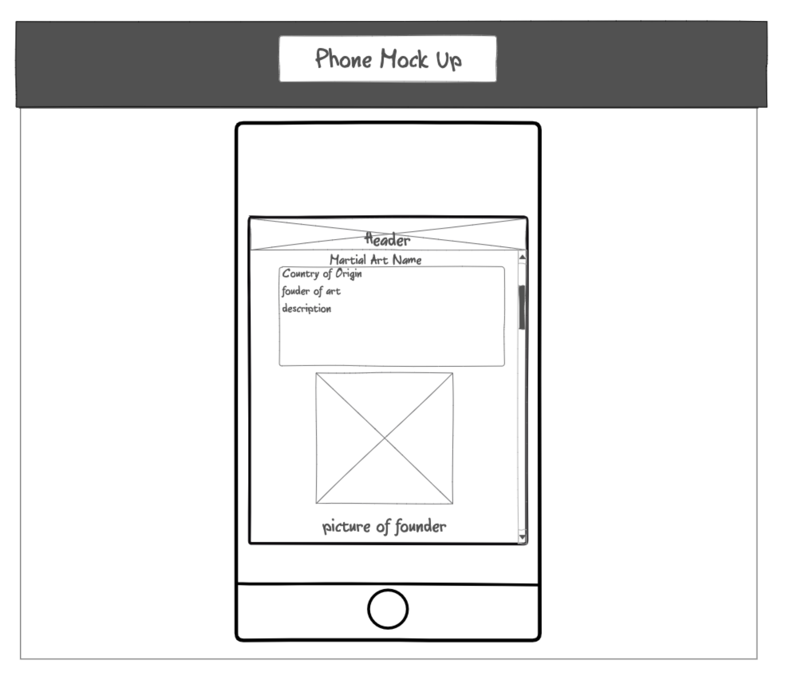
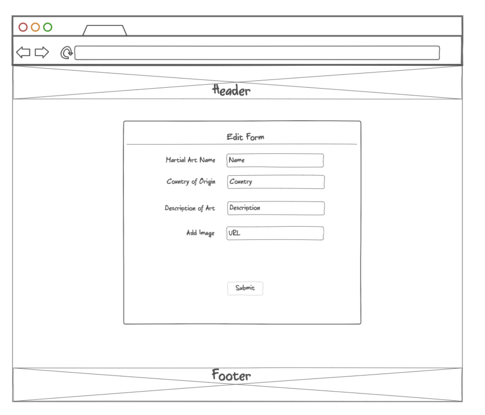
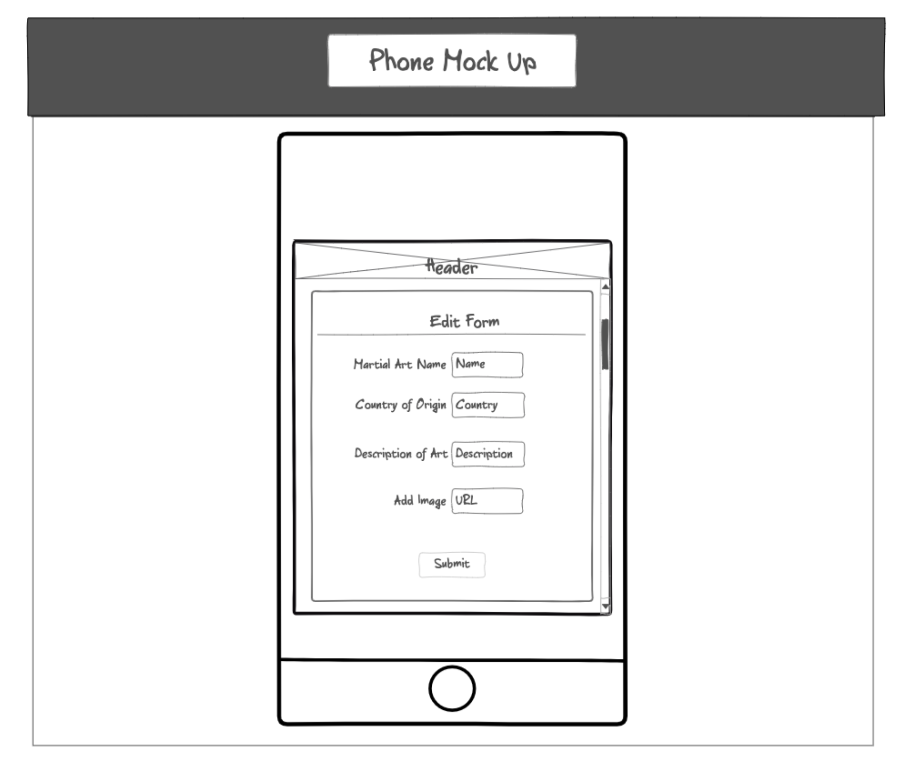
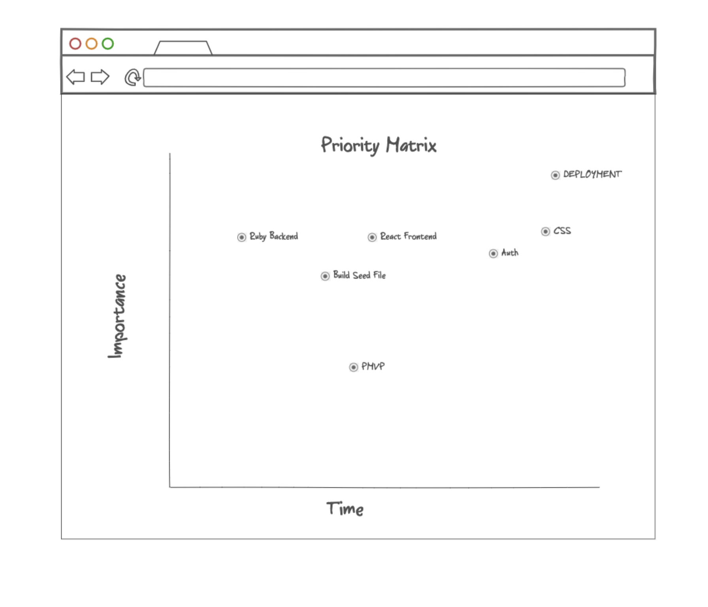
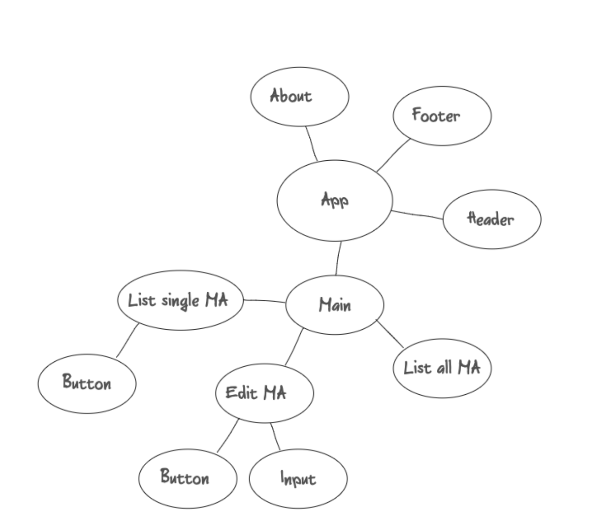
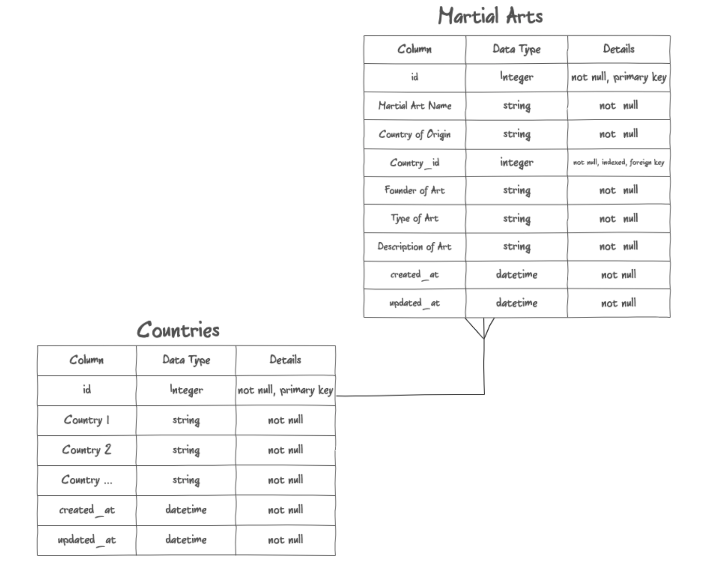

# Project Overview
    This project was a lot of fun and I'm very proud of the MVP. The idea of showing off the beaten path martial arts is something that I'm passionate about so creating a running list with detail and pictures in full CRUD fasion seemed like a great idea.  Because we are fairly new to full stack applications I stayed close to the architecture of the few repos that we did in class. I took my time to make personal adjustments to the code and create something new.  

    I find that I really shined in the styling of this app.  CSS and design are things that I'm supper passionate about.  I really wanted to make the theme fit the content of the app and unknown and undergrown martial arts are synonymous with the gritty neon lights and back allys of the city. 

    
## Project Schedule

This schedule will be used to keep track of your progress throughout the week and align with our expectations.  

You are **responsible** for attending squad standup at the begining and end of the day.

|  Day | Deliverable | Status
|---|---| ---|
|Day 1| Project Approval and Build Seed File | Complete
|Day 2| Rails Backend Completed with full CRUD | Complete
|Day 3| React Component Buildout | Complete
|Day 4| Frontend Complete with full CRUD | Complete
|Day 5| CSS and MVP  | Complete
|Day 6| Deployment & PMVP  | Complete
|Day 7| Present | Incomplete


## Project Description

The Martial World will allow the user to learn about all the martial arts of the world; their country of origin, the founder of the art and a description of its roots. In full CRUD fashion they will be able to add Martial Arts they know about or delete ones they believe are erronious.

## Wireframes







## Priority Matrix


### MVP/PostMVP - 5min

The functionality will then be divided into two separate lists: MPV and PostMVP.  Carefully decided what is placed into your MVP as the client will expect this functionality to be implemented upon project completion.  

#### SAMPLE.....
#### MVP 

- Build a seed table 
- Build a rails backend
- Build a react frontend
- Show martial arts of the world by coutry and individualy
- Allow full CRUD controll of data entries
- Allow images via URL
- Deployment

#### PostMVP 
- AWS images
- Add anther page showcasing the most popular or powerful martial artist of their time.


## Architectural Design



## ERD



## UI Components

Based on the initial logic defined in the previous sections try and breakdown the logic further into stateless/stateful components. 

#### SAMPLE.....
| Component | Description | 
| --- | :---: |  
| Header | This will render the header include the nav | 
| About | This will render info about the author| 
| Footer | This will render the Footer | 
| App | This will render all Components via Routes | 
| Main | This will contain MA by Country, Individual MA and Edit Form | 
| List All MA | This will contain all included MA by country | 
| List Single MA | This will contain individual MA and button to edit form | 
| Edit MA | This will contain the edit and delete form with inputs and a submit button | 


Time frames are also key in the development cycle.  You have limited time to code all phases of the game.  Your estimates can then be used to evalute game possibilities based on time needed and the actual time you have before game must be submitted. It's always best to pad the time by a few hours so that you account for the unknown so add and additional hour or two to each component to play it safe.

#### SAMPLE.....
| Component | Priority | Estimated Time | Actual Time |
| --- | :---: |  :---: | :---: |
| Build seed file | H | 4hrs| 6hrs |
| Set up rails controllers/models | H | 5hrs| 5hrs |
| Test rails endpoints | H | 4hrs| 3hrs | 
| Set up React | H | 6hrs| 4hrs | 
| Build React components | H | 6hrs| 5hrs | 
| Set up API calls | H | 6hrs| 3hrs | 
| CSS | H | 12hrs| 12hrs | 
| Deployment | H | 12hrs| 4hrs | 
| PMVP | H | 8hrs| 0hrs | 
| Total | H | 53hrs| 42hrs | 

## Helper Functions
Helper functions should be generic enought that they can be reused in other applications. Use this section to document all helper functions that fall into this category.

#### SAMPLE.....
| Function | Description | 
| --- | :---: |  
| getAllArts | This function allows me to see all my martial arts | 
| handleDeleteArt | This function allows me to delete an entry from my database table| 
| setArt | This sets the state of the current art. | 

## Additional Libraries
 Use this section to list all supporting libraries and thier role in the project. 
 
 #### SAMPLE.....
- I do not plan on using any libraries


## Code Snippet

Use this section to include a brief code snippet of functionality that you are proud of an a brief description  

#### SAMPLE.....
```

While this code was heavily inspired by effects I found on the internet, I learned a ton from this code.  I messed with every part of it and really learned a lot about box-shadow and how versatile it is.

animation: flicker7 1.9s infinite alternate;
@keyframes flicker7 {

  0%,
  19%,
  21%,
  23%,
  25%,
  54%,
  56%,
  100% {

    text-shadow:
      -0.2rem -0.2rem 1rem #fff,
      0.2rem 0.2rem 1rem #fff,
      0 0 2rem #bc13fe,
      0 0 4rem #bc13fe,
      0 0 6rem #bc13fe,
      0 0 8rem #bc13fe,
      0 0 10rem #bc13fe;

    box-shadow:
      0 0 .5rem #fff,
      inset 0 0 .5rem #fff,
      0 0 2rem #ff0055,
      inset 0 0 2rem #ff0055,
      0 0 4rem #ff0055,
      inset 0 0 4rem #ff0055;
  }

  20%,
  24%,
  55% {
    text-shadow: none;
    box-shadow: none;
  }
}
```

## Change Log
Use this section to document what changes were made and the reasoning behind those changes.  

#### SAMPLE.....
| Original Plan | Outcome | 
| --- | :---: |  
| Have a Main component | Did not implimemnt as it seemed not necessary for organization | 
| Have an About component | Did not implimemnt as I didn't have time and it was deemed non-essential|

## Issues and Resolutions
 Use this section to list of all major issues encountered and their resolution.

#### SAMPLE.....
-I had an issue mapping through an array of images from my seed.  Conditional rendering with && solved this.
-I had an issue with deployment, as I couldn't push to Heroku master. Turns out my .git wasn't positioned right in my file structure.  solved it with a sweet piece of code: git subtree push --prefix APP_NAME/ heroku master